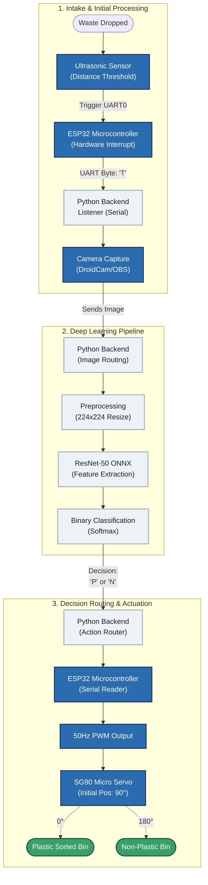

<div align="center">

# Autonomous Edge-Integrated Waste Segregation & Analytics System

**Ultra-Low-Cost, Millisecond-Latency Physical Waste Classification Powered by ResNet-50 and Edge Microcontrollers**

[](https://www.python.org/)
[](https://pytorch.org/)
[](https://onnxruntime.ai/)
[](https://www.espressif.com/)
[](https://www.gnu.org/licenses/agpl-3.0)

</div>

---

## Table of Contents
1. [Executive Summary & Domain Context](#1-executive-summary--domain-context)
2. [System Architecture](#2-system-architecture)
3. [Algorithmic Challenges & Programmatic Mitigations](#3-algorithmic-challenges--programmatic-mitigations)
4. [Mathematical Formulations & Network Dynamics](#4-mathematical-formulations--network-dynamics)
5. [Quantitative Metrics & Benchmark Results](#5-quantitative-metrics--benchmark-results)
6. [Hardware Infrastructure & Bill of Materials](#6-hardware-infrastructure--bill-of-materials)
7. [Repository Folder Structure](#7-repository-folder-structure)
8. [Installation & Deployment](#8-installation--deployment)
9. [Resources and Publications Derived](#9-resources-and-publications-derived)
10. [Authors & Contributors](#10-authors--contributors)
11. [License](#11-license)

---

## 1. Executive Summary & Domain Context

Municipal solid waste management remains one of the most critical environmental and socio-economic bottlenecks in modern urban infrastructure. Standard automated solutions in industrial recycling plants rely on complex Near-Infrared (NIR) hyperspectral systems and proprietary programmable logic controllers (PLCs) that require massive capital expenditure. 

Conversely, relying on cloud-based AI introduces non-deterministic network latency, making synchronous mechanical sorting nearly impossible. This project delivers a hardware-software co-designed edge node that bridges deep learning with commodity microcontrollers. By deploying a heavily optimized ResNet-50 vision engine locally and bypassing standard wireless network stacks via a deterministic UART serial interface, the system achieves near-instantaneous mechanical sorting[cite: 3].

---

## 2. System Architecture

The architecture maps a highly concurrent pipeline, split into physical acquisition, local deep learning inference, and mechanical actuation.



---

## 3. Algorithmic Challenges & Programmatic Mitigations

Training a robust computer vision model on unconstrained municipal waste datasets introduces several critical data anomalies. The training pipeline (`plastic-resnet_2.ipynb`) handles these explicitly:

* **Challenge: Severe Class Imbalance.** Waste datasets are naturally skewed (e.g., significantly more general trash than cleanly isolated plastic).
* *Mitigation:* The pipeline implements a `WeightedRandomSampler`. It calculates the exact distribution via `np.bincount(train_labels)` and derives sample weights as the inverse of these counts (`1.0 / class_counts`), guaranteeing that the ResNet model processes an equalized distribution of plastic and non-plastic features during gradient updates.


* **Challenge: Corrupted Data Streams.** Real-world open-source datasets frequently contain truncated or completely corrupted image headers.
* *Mitigation:* The `BinaryGarbageDataset` class utilizes an explicit `try-except` block during the `__getitem__` call. If `Image.open()` fails or encounters EOF truncation, it gracefully yields a zero-tensor (black image of 224x224) rather than crashing the multi-hour training loop.


* **Challenge: Generalization and Overfitting.** Deep networks easily memorize lighting conditions or background noise.
* *Mitigation:* Beyond standard geometric transforms (Random Resized Crop, rotations), the script dynamically injects `v2.CutMix` and `v2.MixUp` regularizations with a $0.5$ probability threshold during the active training loop, forcing the model to learn localized structural features rather than relying on global image context.


---

## 4. Mathematical Formulations & Network Dynamics

To maximize predictive confidence on highly similar materials (e.g., distinguishing clear plastic from clear glass), the architecture relies on specific mathematical optimizations.

### 4.1. Unweighted Focal Loss

Standard Cross-Entropy loss overwhelms the gradient with highly confident, "easy" predictions. To counteract this, the architecture defines a custom `UnweightedFocalLoss` class. By applying a modulating factor $(1 - p_t)^\gamma$ to the cross-entropy, it forces the optimizer to focus strictly on hard-to-classify examples:

$$FL(p_t) = -(1 - p_t)^\gamma \log(p_t)$$

In this implementation, the focusing parameter is hardcoded to $\gamma = 2.0$, mathematically reducing the relative loss for well-classified examples ($p_t > 0.5$) by a factor of 4 or more.

### 4.2. Softmax Decision Routing

Upon feature extraction, the linear fully connected layer maps to `NUM_CLASSES = 2`. The raw logits ($z$) are converted to normalized probability distributions using the Softmax function before applying the binary decision threshold:

$$P(y=j \mid x) = \frac{e^{z_j}}{\sum_{k=1}^{K} e^{z_k}}$$

---

## 5. Quantitative Metrics & Benchmark Results

The model was rigorously trained for 40 epochs using the AdamW optimizer (learning rate $0.0001$, weight decay $1 \times 10^{-4}$) and a Cosine Annealing scheduler. The following metrics represent the final evaluation on an unseen holdout set of 1,118 instances.

**Real World Accuracy of 87.3 %** ~ 1.02x better than SOA industrial recycling conveyer belt applications. 

### Out-of-Distribution Performance

| Evaluation Metric | Plastic (Class 0) | Non-Plastic (Class 1) | Macro Average |
| --- | --- | --- | --- |
| **Precision** | 0.79 | 0.97 | 0.88 |
| **Recall** | 0.87 | 0.95 | 0.91 |
| **F1-Score** | 0.83 | 0.96 | 0.90 |
| **Support (n)** | 195 | 923 | 1118 |

**Overall System Accuracy: 94.00%**

Note: Peak validation accuracy during the training sequence stabilized at 95.44% (Epoch 38), demonstrating the efficacy of the learning rate decay schedule.

---

## 6. Hardware Infrastructure & Bill of Materials

The physical routing system requires microsecond-accurate deterministic signaling, which is achieved by bypassing wireless stacks in favor of high-baud UART serial links.

| Component | Function | Estimated Cost (INR) |
| --- | --- | --- |
| **ESP32 NodeMCU (x2)** | Hardware interrupts & 50Hz PWM Master | ₹320 |
| **SG90 Micro Servo** | Mechanical Flap Actuator (0° - 180°) | ₹140 |
| **Ultrasonic Sensor (HC-SR04)** | Optical Distance Trigger | ₹60 |
| **Structural Intake Chute** | Mechanical Guidance Enclosure | ₹200 |
| **USB Optical Sensor** | Host PC Frame Acquisition | ₹1500 |
| **Total Edge BOM** |  | **~₹2,220** |

---

## 7. Repository Folder Structure

To ensure maintainability and separation of concerns across edge hardware and deep learning components, the repository adheres to the following structural paradigm:

```text
.
├── app/
│   ├── core/                   # Application config and environment variables
│   ├── backend/                # Python UART listeners and image routing logic
│   └── inference/              # ONNX Runtime wrappers and data normalization
├── firmware/
│   ├── esp32_trigger/          # Ultrasonic interrupt and UART TX ('T') logic
│   └── esp32_actuator/         # UART RX and 50Hz PWM Servo control logic
├── models/
│   ├── weights/                # Serialized best_resnet.pth and .onnx graphs
│   └── thresholds.json         # Heuristic confidence thresholds
├── notebooks/
│   └── plastic-resnet_2.ipynb  # Core training, augmentation, and validation pipeline
├── scripts/
│   ├── export_onnx.py          # Standalone opset 12 graph export utilities
│   └── evaluate_model.py       # Scikit-learn classification report generators
├── requirements.txt            # System dependency declarations
└── README.md

```

---

## 8. Installation & Deployment

### 8.1. Environment Initialization

```bash
git clone [https://github.com/Asmit159/Plastic-Detection.git](https://github.com/Asmit159/Plastic-Detection.git)
cd Plastic-Detection

python -m venv venv
source venv/bin/activate
pip install -r requirements.txt

```

### 8.2. Microcontroller Provisioning

1. Open the Arduino IDE and navigate to the `/firmware/` directory.
2. Flash `esp32_trigger.ino` to the intake microcontroller (verify Ultrasonic trigger pins).
3. Flash `esp32_actuator.ino` to the output microcontroller (verify SG90 PWM on GPIO 18).
4. Establish physical UART loopbacks over USB.

### 8.3. Execution

Initialize the Python orchestration server to begin listening for hardware interrupts and spawning inference threads:

```bash
python app/backend/main.py

```

---

## 9. Resources and Publications Derived

The architectural formulations, objective functions, and optimization strategies deployed in this system are built upon the following foundational research in deep learning and computer vision:

* **ResNet:** He, K., Zhang, X., Ren, S., & Sun, J. (2016). Deep Residual Learning for Image Recognition. *Proceedings of the IEEE Conference on Computer Vision and Pattern Recognition (CVPR)*, 770-778.
* **Focal Loss:** Lin, T. Y., Goyal, P., Girshick, R., He, K., & Dollár, P. (2017). Focal Loss for Dense Object Detection. *Proceedings of the IEEE International Conference on Computer Vision (ICCV)*, 2980-2988.
* **CutMix:** Yun, S., Han, D., Chun, S., Oh, S. J., Yoo, Y., & Choe, J. (2019). CutMix: Regularization Strategy to Train Strong Classifiers with Localizable Features. *Proceedings of the IEEE/CVF International Conference on Computer Vision (ICCV)*.
* **MixUp:** Zhang, H., Cisse, M., Dauphin, Y. N., & Lopez-Paz, D. (2018). mixup: Beyond Empirical Risk Minimization. *International Conference on Learning Representations (ICLR)*.
* **AdamW:** Loshchilov, I., & Hutter, F. (2019). Decoupled Weight Decay Regularization. *International Conference on Learning Representations (ICLR)*.
* **Cosine Annealing (SGDR):** Loshchilov, I., & Hutter, F. (2017). SGDR: Stochastic Gradient Descent with Warm Restarts. *International Conference on Learning Representations (ICLR)*.

---

## 10. Authors & Contributors

### Core Development Team

* **Asmit** - AI Neural Network Model Developer
* **Aditya** - Hardware and Backend Developer

### Contributors & Acknowledgments

* **Jit Mondal** - Machine Learning architecture, computer vision pipeline, and edge integration contributor.
* **Rajashree Roy** - Lead Technical Presenter
* **Arpita Das** - Hardware Developer
* **Jaganmohan Chukka** - Frontend Developer

---

## 11. License

This project is licensed under the **GNU Affero General Public License v3.0 (AGPL-3.0)** - see the [LICENSE](https://www.google.com/search?q=LICENSE) file in the root directory for full legal text and permissions.
