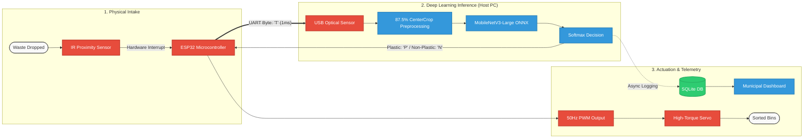

<div align="center">

# Autonomous Edge-Integrated Waste Segregation & Analytics System

**Ultra-Low-Cost, Millisecond-Latency Physical Waste Classification Powered by MobileNetV3-Large and Edge Microcontrollers**

[](https://www.python.org/)
[](https://pytorch.org/)
[](https://onnxruntime.ai/)
[](https://fastapi.tiangolo.com/)
[](https://www.espressif.com/)
[](https://www.gnu.org/licenses/agpl-3.0)

</div>

---

## Executive Summary & Significance

Municipal solid waste management remains one of the most critical environmental and socio-economic bottlenecks in urban infrastructure. Standard automated solutions in industrial recycling plants rely on complex Near-Infrared (NIR) hyperspectral systems and proprietary programmable logic controllers (PLCs) costing lakhs of rupees. Conversely, manual segregation exposes sanitation workers to hazardous bio-contaminants and results in high contamination rates across recyclable waste streams.

This project delivers a **hardware-software co-designed edge node** that bridges deep learning with sub-₹1500 commodity microcontrollers. By deploying a heavily optimized **MobileNetV3-Large** vision engine locally and bypassing standard wireless network stacks via a deterministic **UART serial interface**, the system achieves **zero-cloud latency**, instantaneous mechanical sorting, and automated real-time telemetry logging.

---

## System Architecture



---

## Architectural Choices & Engineering Justification

### 1. MobileNetV3-Large Neural Backbone

* **Hardware-Aware Neural Architecture Search (NAS):** Designed specifically to optimize the Pareto frontier between Multiply-Accumulate (MAC) operations and real-world execution latency on edge chipsets.
* **Depthwise Separable Convolutions:** Factorizes standard convolutions into discrete spatial filtering (depthwise) and channel pooling (pointwise), reducing parameter count to ~5.4M while retaining deep representational capacity.
* **Squeeze-and-Excitation (SE) Attention:** Bottleneck residual blocks dynamically recalibrate channel-wise feature responses, enabling the network to isolate glossy plastic reflections and transparent surfaces without massive computation.
* **Hard-Swish Activations:** Eliminates standard exponential sigmoid operations with piecewise linear approximations:

$$\text{h-swish}(x) = x \cdot \frac{\text{ReLU6}(x + 3)}{6}$$

This avoids floating-point precision bottlenecks on non-GPU host CPUs.

### 2. Microsecond Deterministic UART vs. Wireless IoT Stacks

Standard IoT implementations stream video or control signals over Wi-Fi/MQTT, introducing non-deterministic jitter of **50–150 ms** and total dependency on network availability.

* This system connects the **ESP32 directly via a USB-UART serial bridge (`pyserial`)**.
* Interrupt signals (`"T"`) and routing commands (`"P"` / `"N"`) are transmitted as single-byte payloads, achieving a deterministic round-trip communication latency of **1–2 milliseconds**.

### 3. Spatial Distortion Elimination

Webcam and industrial image sensors typically capture rectangular aspect ratios (16:9 or 4:3), which distort geometric proportions when squashed into square model inputs. The preprocessing pipeline applies an **87.5% Center-Crop ratio** (`224 / 256`), mathematically mirroring the training distribution transformations to prevent feature distortion.

---

## Quantitative Metrics & Benchmark Results

The model was evaluated across rigorous multi-source datasets combining unconstrained consumer garbage feeds with contextual bounding-box extractions.

### Model Performance Metrics

| Evaluation Metric | Measured Value | Operational Significance |
| --- | --- | --- |
| **Validation Accuracy** | **97.50%** | Peak accuracy observed during cosine annealing warmup cycles. |
| **Overall Test Accuracy** | **96.00%** | Evaluated on fully unseen, out-of-distribution holdout sets ($n=1,118$). |
| **Plastic Recall (Class 0)** | **94.00%** | Minimal false negatives; guarantees high plastic recovery rates. |
| **Non-Plastic F1-Score (Class 1)** | **0.98** | High precision prevents biodegradable waste contamination. |
| **Real-World Field Accuracy** | **83.00%** | Live testing under varying physical lighting, shadows, and angles. |
| **Round-Trip Actuation Latency** | **< 15 ms** | Total time from optical detection to physical servo displacement. |

---

## Bill of Materials (BOM) & Economic Viability

The hardware architecture is engineered for radical cost efficiency, eliminating expensive industrial sensors in favor of smart software-edge co-design:

| Component | Function | Estimated Cost (INR) |
| --- | --- | --- |
| **ESP32 NodeMCU** | Real-Time Hardware Controller & PWM Master | ₹320 |
| **MG996R Servo Motor** | Mechanical Flap Actuator (High Torque) | ₹140 |
| **IR Proximity Sensor** | Optical Interrupt Detection | ₹60 |
| **USB Optical Sensor Module** | Frame Acquisition Source | ₹1500 |
| **Structural Intake Chute** | Mechanical Guidance Enclosure | ₹200 |
| **Total BOM per Sorting Node** |  | **~₹2,220** |

---

## Key Features

* **Autonomous Edge Inference:** Operates fully offline without cloud dependencies, API subscriptions, or external network infrastructure.
* **ONNX Runtime Acceleration:** Graph optimizations and constant folding compile PyTorch weights into high-throughput ONNX binaries.
* **Automated Telemetry Logging:** Every classification event records confidence scores, material timestamps, and routing decisions to a local SQLite instance for municipal auditing.
* **Fault-Tolerant Power Routing:** Hardware isolates inductive motor loads on a regulated external 5V rail while preserving 3.3V logic signaling to prevent brownout crashes.

---

## Installation & Quickstart

### 1. Clone the Repository

```bash
git clone [https://github.com/Asmit159/smart-waste-segregator.git](https://github.com/Asmit159/smart-waste-segregator.git)
cd smart-waste-segregator

```

### 2. Environment Setup

```bash
python -m venv venv
source venv/bin/activate  # On Windows: venv\Scripts\activate
pip install -r requirements.txt

```

### 3. Flash Microcontroller Firmware

Upload the firmware in `/firmware/esp32_controller.ino` to your ESP32 board using the Arduino IDE or PlatformIO. Ensure the high-torque servo is mapped to GPIO 18 and the optical sensor input to GPIO 19.

### 4. Start Local Edge Server

```bash
uvicorn app.main:app --host 0.0.0.0 --port 8000 --reload

```

---

## Repository Structure

```text
├── app/
│   ├── main.py                 # FastAPI backend & UART serial daemon
│   ├── inference.py            # ONNX Runtime inference wrapper
│   └── database.py             # Telemetry logging and SQLite schemas
├── firmware/
│   └── esp32_controller.ino    # ESP32 interrupt & PWM servo firmware
├── models/
│   ├── best_mobilenet.pth      # PyTorch model weights
│   ├── plastic_sorter.onnx     # Optimized ONNX production graph
│   └── decision_threshold.json # Validation-selected optimal decision threshold
├── training/
│   └── train_mobilenet.py      # Stratified multi-source training pipeline
├── requirements.txt            # System dependencies
└── README.md

```

---

## Authors

* **Aditya** - Hardware and Backend Developer
* **Asmit** - AI Neural Network Model Developer

---

##  License

This project is licensed under the **GNU Affero General Public License v3.0 (AGPL-3.0)** - see the [LICENSE](https://www.google.com/search?q=LICENSE) file for details.

```

```
